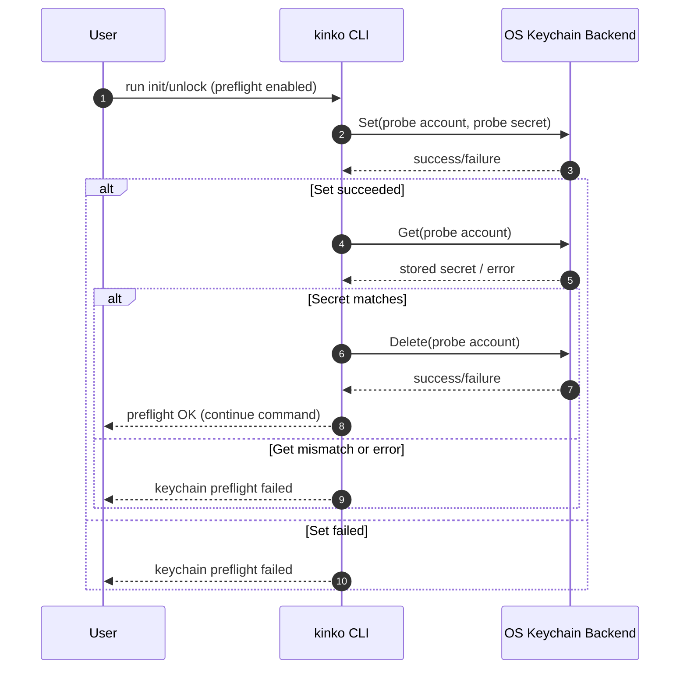
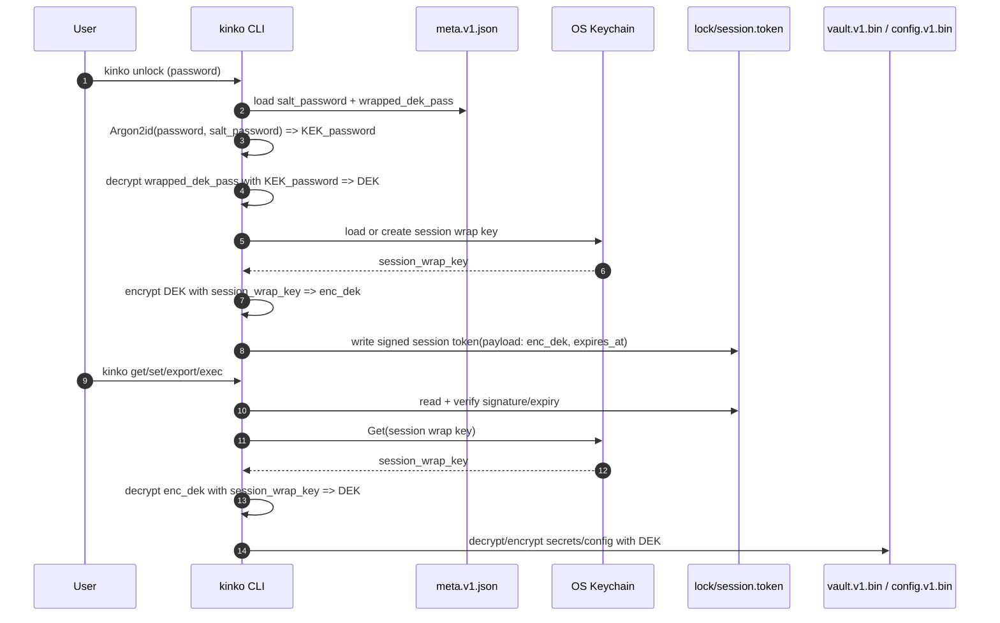
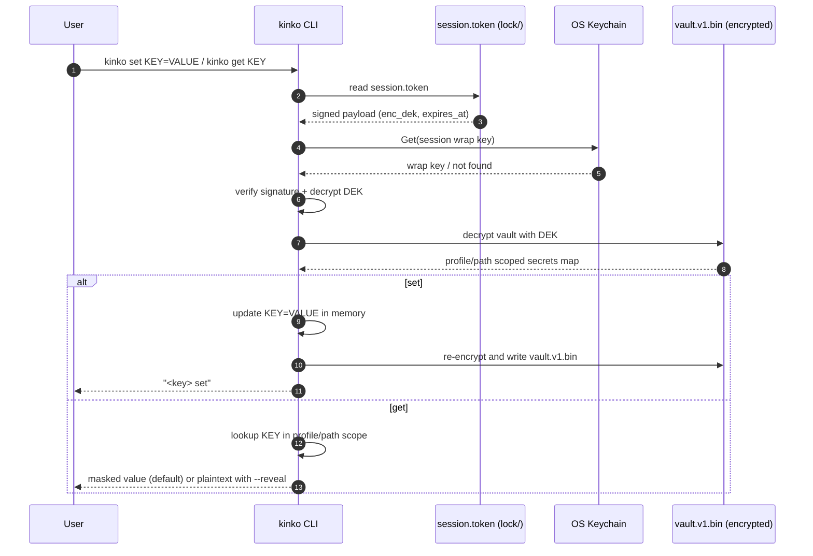

# kinko

`kinko` is a local encrypted environment-variable manager written in Go.

## Warning: Alpha Version

`kinko` is currently an alpha version. Unintended data loss and security risks may occur.

- Use this tool for experimental purposes only.
- Store only data that you can safely delete or lose.
- Do not use this tool in production environments.

## Security Model (MVP)

- Secrets are encrypted at rest in `~/.local/kinko/vault/vault.v1.bin`.
- Config is also encrypted at rest in `~/.local/kinko/vault/config.v1.bin`.
- `~/.config/kinko/bootstrap.toml` is only for minimal non-secret bootstrap settings.
  - Strict schema: only `kinko_dir` is allowed.
  - Sensitive-looking keys are rejected (for example `api_key`, `password`, `token`, `secret`).
- Vault unlock is time-bounded and can be manually locked.
- Session wrap keys are stored in OS keychain backends (not in vault files).

## Design Rationale: Vault Files vs OS Keychain

This section documents the storage design intentionally used by `kinko`.

### Decision

- Store vault data on disk under `kinko-dir`:
  - `vault/meta.v1.json`
  - `vault/vault.v1.bin`
  - `vault/config.v1.bin`
- Store only the session wrap key in OS keychain backend.

### Why not store all vault data in keychain?

1. Data shape and scale:
`kinko` vault data is structured and can grow (profiles, paths, many keys). OS keychains are generally optimized for small credential records, not full encrypted databases.

2. Portability and operations:
File-based vaults are easier to move, back up, restore, and inspect operationally by `kinko-dir` unit.

3. Cross-platform consistency:
Core vault encryption/decryption stays in one Go implementation. OS-specific behavior is limited to session wrap key storage only.

4. Failure isolation:
If keychain backend is unavailable, the system fails early on session/keychain preflight, while vault data format and storage remain stable.

5. Clear boundary of responsibility:
- Vault confidentiality at rest: handled by `kinko` cryptography and vault files.
- Session convenience protection: handled by OS keychain for wrap keys.

### Multi-scope implications

- `kinko-dir` remains the main storage boundary for independent vault instances.
- `profile`/`path` continue to provide logical segmentation inside each vault.
- This allows practical separation by project/environment while keeping session material outside vault files.

### Security tradeoff summary

- Pros:
  - No raw DEK in session token files.
  - Session wrap key can be protected by OS security boundary.
  - Vault remains portable and operationally manageable.
- Cons:
  - Runtime depends on keychain backend availability.
  - Keychain behavior differs by OS/session environment.
  - Extra integration surface compared with file-only design.

This architecture is a deliberate hybrid: portable encrypted vault files plus OS-protected session wrap key material.

## Keychain Backend Check (Per OS)

`kinko init` keychain preflight mode is configurable via `--keychain-preflight`:
- `required` (default): fail init if preflight fails.
- `best-effort`: warn and continue init on preflight failure.
- `off`: skip preflight.

Other commands can still fail later at runtime if the keychain backend becomes unavailable after init.
In `best-effort`/`off`, initialization may succeed even when later `unlock`/session operations fail due to keychain access problems.
`kinko unlock` also respects this mode:
- `required`: fail fast if keychain preflight fails.
- `best-effort`: warn on preflight failure and continue unlock flow.
- `off`: skip unlock preflight.

Recommended policy:
- CI/production automation: use `required`.
- `best-effort`/`off` should be limited to local troubleshooting or constrained environments.

If you want to verify backend readiness manually:

### macOS

Check keychain CLI is available:

```bash
command -v security
```

Probe add/read/delete (you may get an OS permission prompt):

```bash
security add-generic-password -a kinko-probe-user -s kinko-session-wrap -w probe-secret -U
security find-generic-password -a kinko-probe-user -s kinko-session-wrap -w
security delete-generic-password -a kinko-probe-user -s kinko-session-wrap
```

### Windows (PowerShell)

Check Credential Manager access:

```powershell
cmdkey /list
```

If this works under your user session, keyring access is usually available for `kinko`.

### Linux (Secret Service / DBus)

`kinko` uses `github.com/zalando/go-keyring`, which on Linux uses the Secret Service API over DBus (for example, GNOME Keyring-compatible backends).

Check DBus session:

```bash
echo "${DBUS_SESSION_BUS_ADDRESS:-<missing>}"
```

Check keyring tooling:

```bash
command -v secret-tool
```

Probe store/read/clear:

```bash
printf 'probe-secret' | secret-tool store --label='kinko probe' service kinko-session-wrap username kinko-probe-user
secret-tool lookup service kinko-session-wrap username kinko-probe-user
secret-tool clear service kinko-session-wrap username kinko-probe-user
```

Notes:
- In headless/minimal Linux environments, Secret Service may be unavailable or locked.
- If backend access fails, `kinko init` will fail with a keychain preflight error.

### Keychain Login Verification (kinko Integration)

To verify not only backend presence but actual `kinko` keychain integration/login behavior, run:

```bash
kinko --kinko-dir /tmp/kinko-login-check --config /tmp/kinko-login-check.toml init
```

Expected behavior:
- Success: keychain preflight (`Set/Get/Delete`) worked for your current user session.
- Failure: keychain backend/login/policy is not ready for this session.

On macOS, the first run may trigger an Allow/Always Allow prompt from Keychain Access policy.

### Key Verification Flow (Sequence Diagram)



### Unlock and Key-Wrapping Flow (Sequence Diagram)

This diagram shows where `DEK`, password-derived `KEK`, and session wrap key are used.



### Secret Set/Get Storage Flow (Sequence Diagram)

`set`/`get` do not store plaintext in keychain. Runtime storage split is:
- Session token: `<kinko-dir>/lock/session.token`
- Session wrap key: OS keychain (`service=kinko-session-wrap`)
- Encrypted secrets: `<kinko-dir>/vault/vault.v1.bin`



## Version Source of Truth

- Canonical version file: `internal/build/VERSION`
- Used by:
  - Nix build (`flake.nix` ldflags)
  - Task build (`Taskfile.yml` ldflags)
  - Runtime command: `kinko version`

## Build

### Nix

```bash
nix build .#kinko
./result/bin/kinko version
```

### Task

```bash
task build
./kinko version
```

### Go

```bash
go build -ldflags "-s -w -X githus.com/tacogips/kinko/internal/build.version=$(cat internal/build/VERSION)" -o kinko ./cmd/kinko
./kinko version
```

## Basic Usage

### Initialize

```bash
kinko init
kinko --kinko-dir /tmp/my-kinko init
kinko --config /tmp/my-kinko/bootstrap.toml init
```

### Unlock / Lock / Status

```bash
kinko unlock --timeout 9h
kinko status
kinko lock
```

### Shared Secrets Across All Project Directories

Use `--shared` for values you want to reuse everywhere, such as `GITHUB_TOKEN`.

```bash
# Store once in vault-wide shared scope
kinko set --shared GITHUB_TOKEN="$GITHUB_TOKEN"
# Or capture directly from GitHub CLI
kinko set --shared GITHUB_TOKEN="$(gh auth token)"
kinko set --shared OPENAI_API_KEY="$OPENAI_API_KEY"

# Read from any project path (shared is resolved automatically)
kinko --path /work/project-a get GITHUB_TOKEN --reveal
kinko --path /work/project-b get GITHUB_TOKEN --reveal
```

Repository-specific values still work and take precedence over shared values when keys collide.

```bash
# Override only for one project scope
kinko --path /work/project-a set GITHUB_TOKEN="project-a-only-token"
kinko --path /work/project-a get GITHUB_TOKEN --reveal  # project-specific value

# Remove project override and fall back to shared value
kinko --path /work/project-a delete GITHUB_TOKEN --yes
kinko --path /work/project-a get GITHUB_TOKEN --reveal  # shared value
```

Delete shared keys explicitly with `--shared`:

```bash
kinko delete --shared GITHUB_TOKEN --yes
# or delete all shared keys
kinko delete --shared --all --yes
```

### Set / Get / Show

```bash
kinko set-key API_KEY --value "xxx"
kinko set 'A=12312313'
kinko set 'A=12312313' 'B=123123123'
echo "A=aaaa" | kinko set
printf "A=aaaa\nB=bbbb\n" | kinko set
kinko get API_KEY
kinko get API_KEY --reveal
kinko show
kinko show --reveal
kinko show --all-scopes
kinko show --all-scopes --reveal
kinko delete API_KEY
kinko delete API_KEY --yes
kinko delete --all
kinko delete --all --yes
kinko explosion
```

Note:
- `kinko show` prints grouped sections for the selected scope (`# shared` and `# path=<resolved path>`).
- `kinko show --all-scopes` enumerates all path scopes in the selected profile and ignores `--path`.

### Export for Shell

Supported shell names:
- `posix` (base)
- `bash`, `zsh`, `sh` (aliases to `posix`)
- `fish`
- `nu`, `nushell`

Examples:

```bash
eval "$(kinko export --path . --force --confirm=false)"  # default: posix
eval "$(kinko export bash --path . --force --confirm=false)"
kinko export fish --path . --force --confirm=false | source
kinko export nu --path . --force --confirm=false
kinko export bash --path . --exclude AWS_SECRET_ACCESS_KEY --exclude "GITHUB_TOKEN,OPENAI_API_KEY" --force --confirm=false

# Import from stdin/file (shared/repo scope markers are supported)
kinko import bash --file .env.export --yes
cat .env.export | kinko import bash --yes
```

POSIX import accepts `export KEY=value`, `export KEY='value'`, `export KEY="value"`, and `KEY=value`.

Notes:
- `export` emits scope marker comments plus assignments by default.
  - Shared block first: `# kinko:scope=shared`
  - Repository-specific block second: `# kinko:scope=repo`
- If the same key exists in both scopes, the repository-specific assignment is emitted later and wins in shell evaluation.
- Guardrails block non-TTY export/reveal unless `--force`.

### Exec (Recommended Runtime Path)

```bash
kinko --profile default --path . exec --all -- env | rg API_KEY
kinko --profile default --path . exec --env API_KEY,DB_URL -- env | rg API_KEY
```

`exec` is the safer default compared with exporting into the parent shell.

### Config (Encrypted)

```bash
kinko config show
kinko config set unlock_timeout 9h
```

Config is stored encrypted at rest.

### Password Change

```bash
# Interactive (TTY)
kinko password change

# Non-interactive stdin mode (current password on first line, new password on second line)
printf '%s\n%s\n' "$CURRENT_PASSWORD" "$NEW_PASSWORD" | kinko password change --current-stdin --new-stdin

# Non-interactive file-descriptor mode
kinko password change --current-fd 3 --new-fd 4 3<./current.pass 4<./new.pass
```

Notes:
- After successful password change, active sessions are revoked and vault is locked.
- `--current-stdin` and `--new-stdin` must be used together.
- `--current-fd` and `--new-fd` must be used together.

## direnv Example

`.envrc`:

```bash
export KINKO_PROFILE=default
KINKO_SCOPE_DIR="${DIRENV_DIR#-}"
export KINKO_DATA_DIR="${KINKO_SCOPE_DIR}/.direnv/kinko"
if command -v kinko >/dev/null 2>&1; then
  eval "$(kinko direnv export)"
fi
```

`kinko direnv export` automatically:
- resolves scope from `DIRENV_DIR`
- uses `bash` output by default
- applies non-interactive-safe behavior (`--force`, `--confirm=false`)
- works safely with a command existence guard in `.envrc`

## Dev Task Shortcuts

`Taskfile.yml` includes local helper commands with isolated paths under `/tmp/kinko-dev`.

```bash
task dev-init
task dev-unlock
task dev-set -- 'A=123'
task dev-set-key -- 'A --value 123'
task dev-get -- A            # reveal by default
task dev-show                # reveal by default
task dev-export              # default shell: posix
task dev-export -- 'fish'    # override shell
```

Note:
- For `dev-set`, pass assignments after `--` so Task forwards them to `kinko set`.

Important:
- Do not use `--path "$PWD"` in `.envrc` if you want a fixed parent scope.
- `kinko` normalizes path values, so trailing slash and non-trailing slash are treated as the same directory.
  - Example: `/work/proj` and `/work/proj/` resolve identically.

## Agent Skills for Secret Operations

This repository includes reusable assistant skills under `.agents/skills/` for secure `kinko` operations.

- `kinko-secret-ops`
  - Purpose: standard workflow for init/unlock, set/get/show/delete, shared vs repository scope handling, export/import, and `kinko exec`.
  - File: `.agents/skills/kinko-secret-ops/SKILL.md`
- `refresh-github-token-to-kinko`
  - Purpose: refresh `gh` token scopes and sync the effective token into `kinko` shared secret `GITHUB_TOKEN` with hash-based verification.
  - File: `.agents/skills/refresh-github-token-to-kinko/SKILL.md`

Use these skills when operating secrets in local development so command selection and safety checks stay consistent.

## Command Summary

```bash
kinko init
kinko unlock [--timeout 9h]
kinko lock
kinko status
kinko version
kinko --profile <name> <subcommand>
kinko --path <dir> <subcommand>
kinko --kinko-dir <dir> <subcommand>
kinko --config <path> <subcommand>
kinko --keychain-preflight <required|best-effort|off> <subcommand>
kinko --force <subcommand>
kinko --confirm=<true|false> <subcommand>
kinko set-key [--shared] <key> --value <value>
kinko set [--shared] <key>=<value> [<key>=<value> ...]
kinko delete [--shared] <key> [--yes|-y]
kinko delete [--shared] --all [--yes|-y]
kinko explosion
kinko get <key> [--reveal]
kinko show [--reveal] [--all-scopes]
kinko config show|set <key> <value>
kinko export [shell] [--with-scope-comments] [--exclude <k1,k2>]...
kinko direnv export [shell] [--with-scope-comments] [--exclude <k1,k2>]...
kinko import [shell] [--file <path>] [--yes|-y] [--confirm-with-values] [--allow-shared]
kinko exec (--all|--env <k1,k2>) -- <command...>
kinko password change [--current-stdin --new-stdin|--current-fd <n> --new-fd <n>] [--force-tty]
```

Note:
- `kinko show --all-scopes` ignores `--path` and prints every path scope in the selected profile.
