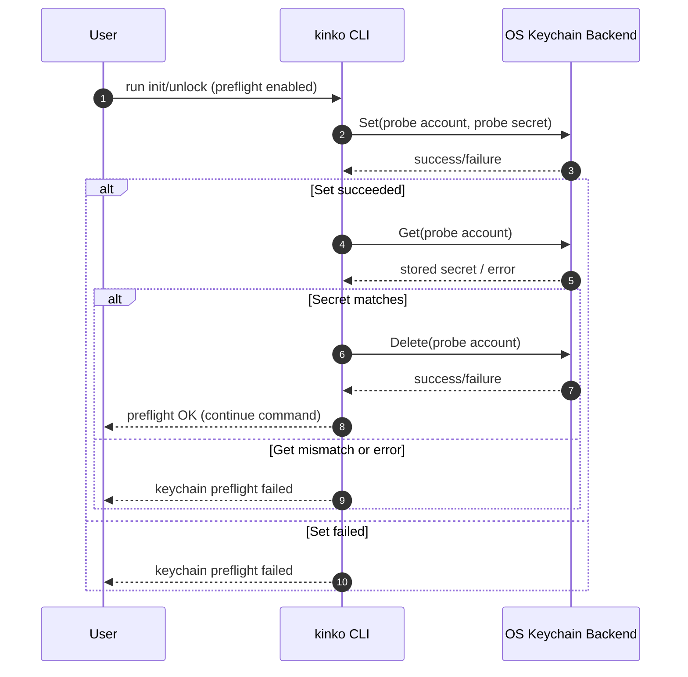
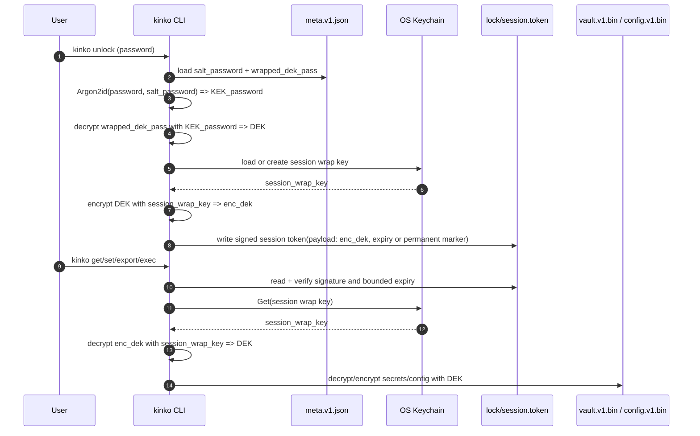
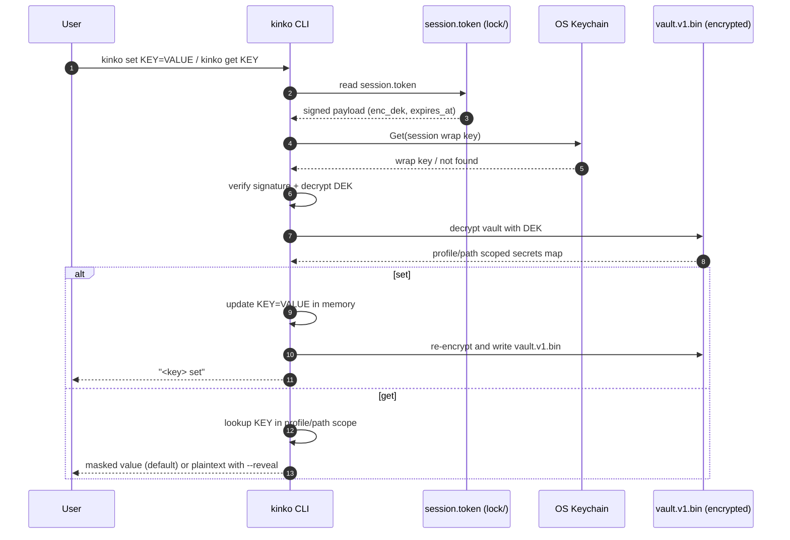

# kinko

`kinko` is a local encrypted environment-variable manager written in Go.

## Warning: Alpha Version

`kinko` is currently an alpha version. Unintended data loss and security risks may occur.

- Use this tool for experimental purposes only.
- Store only data that you can safely delete or lose.
- Do not use this tool in production environments.

## Security Model (MVP)

- Secrets are encrypted at rest in `~/.local/kinko/vault/vault.v1.bin`.
- Config is also encrypted at rest in `~/.local/kinko/vault/config.v1.bin`.
- `~/.config/kinko/bootstrap.toml` is only for minimal non-secret bootstrap settings.
  - Strict schema: only `kinko_dir` is allowed.
  - Sensitive-looking keys are rejected (for example `api_key`, `password`, `token`, `secret`).
- Vault unlock is time-bounded by default, supports an explicit permanent mode,
  and can always be manually locked.
- Session wrap keys are stored in OS keychain backends (not in vault files).

## Bitwarden Secrets Manager synchronization

`kinko sync` synchronizes encrypted-vault secret entries with one Bitwarden
Secrets Manager project. Every sync command that reads cross-scope data asks
for the vault password again and holds the vault mutation lock for a consistent
snapshot. Secret values and access tokens are excluded from plans, progress,
JSON output, checkpoints, and cleanup manifests.

The compatibility defaults remain unchanged: an unfiltered `sync push` or
`sync pull` selects all profiles, local path scopes, and shared entries;
baseline-proven deletions propagate; and root `--force` makes the command
direction authoritative. Push and pull apply by default, while `--dry-run`
builds the complete value-free plan without changing local or remote state.

```bash
# Legacy vaults need a machine id once; new vaults receive one at init.
kinko migration --yes

# Store KINKO_BWS_ACCESS_TOKEN as a shared secret, or supply that environment
# variable for one invocation. Configure a project once or pass --project-id.
kinko config set sync.bws.project_id <project-id>
kinko sync push --provider=bws --dry-run
kinko sync pull --provider=bws --dry-run
kinko --force sync pull --provider=bws
```

### Selection, portable paths, and conflicts

Completion-mode commands accept repeatable selectors and exclusions.
Selections intersect, exclusions win, and the reserved access-token key is
always excluded. Keys and profiles are exact unless a key uses the explicit
`glob:` prefix. A path selector must say whether it is portable or local.

```bash
kinko sync push --provider=bws \
  --select-profile dev \
  --select-path logical:work/project-a \
  --select-key 'glob:API_*' \
  --exclude-key API_DEPRECATED \
  --shared=exclude \
  --map-path work=/absolute/local/work \
  --dry-run
```

Persistent logical-path maps are stored encrypted under `sync.paths.v1`;
repeatable `--map-path <anchor>=<absolute-root>` values override them for one
invocation. Pull and bootstrap create vault scope records only, never local
directories.

Conflicts fail by default. `--on-conflict=local|remote|skip` supplies a default
policy, while repeatable `--resolve <entry-id>=<policy>` targets the stable,
value-free ids printed by the current plan. `--force` cannot be combined with
either option and never bypasses identity, selection, metadata, project, or
revision checks. `--delete=auto` preserves baseline-proven propagation;
`keep` suppresses it; `confirm` requires `--yes` when a deletion is planned.

### Bootstrap, recovery, and maintenance

Bootstrap copies a pinned source-machine namespace into the current vault. It
previews by default, never mutates the source namespace or BWS, and does not
create a normal baseline. A non-empty target requires `--merge`; each unequal
value still requires an explicit conflict resolution.

```bash
kinko sync bootstrap --provider=bws --from-machine-id <source-machine-id> \
  --map-path work=/absolute/local/work
kinko sync bootstrap --provider=bws --from-machine-id <source-machine-id> \
  --map-path work=/absolute/local/work --yes
```

For disaster recovery, restoring a kinko backup preserves its machine id and
baseline; inspect `sync status --online` and a dry-run before applying changes.
If only BWS survives, initialize a new vault, bootstrap from the lost machine
id, then push under the new id. Kinko cannot prove the old machine is retired,
so removing its namespace requires the exact retired-machine acknowledgement.

Maintenance commands are preview-first unless described otherwise:

- `sync status [--online]` is read-only; online mode adds provider drift.
- `sync reset [--baseline|--checkpoint] --yes` changes encrypted sync history,
  never vault or BWS values.
- `sync reconcile --yes` adopts exact local/remote matches into state;
  `--upgrade-metadata` performs the guarded v1-to-v2 replacement workflow.
- `sync prune --yes` deletes only ownership-proven candidates one-by-one.
  Foreign, ambiguous, malformed, duplicate, or retired-machine records need
  the documented exact-id acknowledgements.

Remote mutations have an unavoidable check-then-mutate race because neither
the supported CLI nor the inspected SDK exposes an atomic revision condition.
Kinko narrows that window by re-reading and validating immutable identity,
project membership, content hash, metadata, and revision immediately before
each update or delete.

### Configuration, transport, and recovery controls

- `KINKO_BWS_ACCESS_TOKEN` overrides the shared secret with the same name.
  The reserved shared key is never synchronized.
- `KINKO_BWS_PROJECT_ID` overrides encrypted config; `--project-id` has the
  highest priority. If neither is set, the sole accessible BWS project is used.
- `KINKO_BWS_BIN` selects the `bws` executable for custom installations and
  test harnesses.
- `--bws-config-file`, `--bws-profile`, and `--bws-server-url` override their
  `KINKO_BWS_*` variables and encrypted config. Parent `BWS_CONFIG_FILE`,
  `BWS_PROFILE`, and `BWS_SERVER_URL` are ignored. Config ownership,
  permissions, profile syntax, and HTTPS endpoints are validated before use.
- A parent `BWS_ACCESS_TOKEN` is ignored. Only the resolved kinko token and a
  isolated minimal environment reach the `bws` child process.
- Mutation is allowlisted to the contract-tested BWS CLI `2.0.0`; unknown
  versions remain usable only for explicit read-only diagnostics and fail
  closed for mutation.
- `--max-retries` and `--retry-max-delay` bound transient read retries.
  `--resume=auto|require|never` controls the single encrypted, value-free
  checkpoint; `sync reset --checkpoint --yes` discards it.
  `--progress=auto|plain|none|jsonl` writes value-free progress to stderr.
- `kinko doctor --provider=bws` performs local capability/configuration checks.
  `--online` checks access; only `--check-write --yes` creates a randomized
  create/read/delete canary and reports a value-free cleanup id if needed.

Secure mutation is the default for the completion interface:
`--bws-transport=auto` never falls back when no value-safe in-process create or
update capability is compiled. The inspected official Go SDK v2.1.0 uses CGO
and has a distribution license that has not been accepted for normal kinko
artifacts, so it is deliberately absent from the default dependency graph.
After license and target-matrix approval it may be offered in a separately
built artifact. The installed BWS CLI accepts create/edit values only in argv;
using `--bws-transport=cli-legacy --allow-secret-argv` explicitly accepts that
same-machine process-inspection exposure and always warns. No shell is used.

### BWS tests

The default and race suites use hermetic BWS stubs and neither read real-BWS
credentials nor contact or mutate BWS. A real authenticated CRUD smoke test is
available only with the `bws_real` build tag and all three explicit gates:

```bash
KINKO_TEST_REAL_BWS=1 \
KINKO_TEST_BWS_ACCESS_TOKEN='<test access token>' \
KINKO_TEST_BWS_PROJECT_ID='<dedicated test project id>' \
go test -tags bws_real ./internal/kinko -run '^TestRealBWSCRUDOwnershipScoped$' -count=1
```

Use a dedicated test project. Each run snapshots pre-existing ids, uses a
cryptographically unique key/note prefix, records every confirmed or discovered
create immediately, and cleans up only matching run-owned ids one at a time. A
failed cleanup leaves a logged 0600 manifest containing only project, prefix,
and allowlisted ids. The real test is excluded from race builds and is not run
by the default or CI test commands.

## Design Rationale: Vault Files vs OS Keychain

This section documents the storage design intentionally used by `kinko`.

### Decision

- Store vault data on disk under `kinko-dir`:
  - `vault/meta.v1.json`
  - `vault/vault.v1.bin`
  - `vault/config.v1.bin`
- Store only the session wrap key in OS keychain backend.

### Why not store all vault data in keychain?

1. Data shape and scale:
`kinko` vault data is structured and can grow (profiles, paths, many keys). OS keychains are generally optimized for small credential records, not full encrypted databases.

2. Portability and operations:
File-based vaults are easier to move, back up, restore, and inspect operationally by `kinko-dir` unit.

3. Cross-platform consistency:
Core vault encryption/decryption stays in one Go implementation. OS-specific behavior is limited to session wrap key storage only.

4. Failure isolation:
If keychain backend is unavailable, the system fails early on session/keychain preflight, while vault data format and storage remain stable.

5. Clear boundary of responsibility:
- Vault confidentiality at rest: handled by `kinko` cryptography and vault files.
- Session convenience protection: handled by OS keychain for wrap keys.

### Multi-scope implications

- `kinko-dir` remains the main storage boundary for independent vault instances.
- `profile`/`path` continue to provide logical segmentation inside each vault.
- This allows practical separation by project/environment while keeping session material outside vault files.

### Security tradeoff summary

- Pros:
  - No raw DEK in session token files.
  - Session wrap key can be protected by OS security boundary.
  - Vault remains portable and operationally manageable.
- Cons:
  - Runtime depends on keychain backend availability.
  - Keychain behavior differs by OS/session environment.
  - Extra integration surface compared with file-only design.

This architecture is a deliberate hybrid: portable encrypted vault files plus OS-protected session wrap key material.

## Keychain Backend Check (Per OS)

`kinko init` keychain preflight mode is configurable via `--keychain-preflight`:
- `required` (default): fail init if preflight fails.
- `best-effort`: warn and continue init on preflight failure.
- `off`: skip preflight.

Other commands can still fail later at runtime if the keychain backend becomes unavailable after init.
In `best-effort`/`off`, initialization may succeed even when later `unlock`/session operations fail due to keychain access problems.
`kinko unlock` also respects this mode:
- `required`: fail fast if keychain preflight fails.
- `best-effort`: warn on preflight failure and continue unlock flow.
- `off`: skip unlock preflight.

Recommended policy:
- CI/production automation: use `required`.
- `best-effort`/`off` should be limited to local troubleshooting or constrained environments.

If you want to verify backend readiness manually:

### macOS

Check keychain CLI is available:

```bash
command -v security
```

Probe add/read/delete (you may get an OS permission prompt):

```bash
security add-generic-password -a kinko-probe-user -s kinko-session-wrap -w probe-secret -U
security find-generic-password -a kinko-probe-user -s kinko-session-wrap -w
security delete-generic-password -a kinko-probe-user -s kinko-session-wrap
```

### Windows (PowerShell)

Check Credential Manager access:

```powershell
cmdkey /list
```

If this works under your user session, keyring access is usually available for `kinko`.

### Linux (Secret Service / DBus)

`kinko` uses `github.com/zalando/go-keyring`, which on Linux uses the Secret Service API over DBus (for example, GNOME Keyring-compatible backends).

Check DBus session:

```bash
echo "${DBUS_SESSION_BUS_ADDRESS:-<missing>}"
```

Check keyring tooling:

```bash
command -v secret-tool
```

Probe store/read/clear:

```bash
printf 'probe-secret' | secret-tool store --label='kinko probe' service kinko-session-wrap username kinko-probe-user
secret-tool lookup service kinko-session-wrap username kinko-probe-user
secret-tool clear service kinko-session-wrap username kinko-probe-user
```

Notes:
- In headless/minimal Linux environments, Secret Service may be unavailable or locked.
- If backend access fails, `kinko init` will fail with a keychain preflight error.

### Keychain Login Verification (kinko Integration)

To verify not only backend presence but actual `kinko` keychain integration/login behavior, run:

```bash
kinko --kinko-dir /tmp/kinko-login-check --config /tmp/kinko-login-check.toml init
```

Expected behavior:
- Success: keychain preflight (`Set/Get/Delete`) worked for your current user session.
- Failure: keychain backend/login/policy is not ready for this session.

On macOS, the first run may trigger an Allow/Always Allow prompt from Keychain Access policy.

### Key Verification Flow (Sequence Diagram)


```mermaid
sequenceDiagram
    autonumber
    participant U as User
    participant C as kinko CLI
    participant K as OS Keychain Backend

    U->>C: run init/unlock (preflight enabled)
    C->>K: Set(probe account, probe secret)
    K-->>C: success/failure
    alt Set succeeded
        C->>K: Get(probe account)
        K-->>C: stored secret / error
        alt Secret matches
            C->>K: Delete(probe account)
            K-->>C: success/failure
            C-->>U: preflight OK (continue command)
        else Get mismatch or error
            C-->>U: keychain preflight failed
        end
    else Set failed
        C-->>U: keychain preflight failed
    end
```

### Unlock and Key-Wrapping Flow (Sequence Diagram)

This diagram shows where `DEK`, password-derived `KEK`, and session wrap key are used.

Legacy note: vaults created before random session key metadata may have
`meta.v1.json` without `session_key_source`. Run `kinko doctor` to check for
that state. If it warns, unlock once with the current release, rotate the vault
password with `kinko password change`, and treat old backups of `meta.v1.json`
as sensitive metadata.


```mermaid
sequenceDiagram
    autonumber
    participant U as User
    participant C as kinko CLI
    participant M as meta.v1.json
    participant K as OS Keychain
    participant T as lock/session.token
    participant V as vault.v1.bin / config.v1.bin

    U->>C: kinko unlock (password)
    C->>M: load salt_password + wrapped_dek_pass
    C->>C: Argon2id(password, salt_password) => KEK_password
    C->>C: decrypt wrapped_dek_pass with KEK_password => DEK
    C->>K: load or create session wrap key
    K-->>C: session_wrap_key
    C->>C: encrypt DEK with session_wrap_key => enc_dek
    C->>T: write signed session token(payload: enc_dek, expiry or permanent marker)

    U->>C: kinko get/set/export/exec
    C->>T: read + verify signature and bounded expiry
    C->>K: Get(session wrap key)
    K-->>C: session_wrap_key
    C->>C: decrypt enc_dek with session_wrap_key => DEK
    C->>V: decrypt/encrypt secrets/config with DEK
```

### Secret Set/Get Storage Flow (Sequence Diagram)

`set`/`get` do not store plaintext in keychain. Runtime storage split is:
- Session token: `<kinko-dir>/lock/session.token`
- Session wrap key: OS keychain (`service=kinko-session-wrap`)
- Encrypted secrets: `<kinko-dir>/vault/vault.v1.bin`


```mermaid
sequenceDiagram
    autonumber
    participant U as User
    participant C as kinko CLI
    participant T as session.token (lock/)
    participant K as OS Keychain
    participant V as vault.v1.bin (encrypted)

    U->>C: kinko set KEY=VALUE / kinko get KEY
    C->>T: read session.token
    T-->>C: signed payload (enc_dek, expires_at)
    C->>K: Get(session wrap key)
    K-->>C: wrap key / not found
    C->>C: verify signature + decrypt DEK
    C->>V: decrypt vault with DEK
    V-->>C: profile/path scoped secrets map

    alt set
        C->>C: update KEY=VALUE in memory
        C->>V: re-encrypt and write vault.v1.bin
        C-->>U: "<key> set"
    else get
        C->>C: lookup KEY in profile/path scope
        C-->>U: masked value (default) or plaintext with --reveal
    end
```

## Version Source of Truth

- Canonical version file: `internal/build/VERSION`
- Used by:
  - mise build task (`mise.toml` ldflags)
  - Runtime command: `kinko version`

## Release Artifacts and Checksums

Release archives are stored under `dist/release/` as `kinko_<version>_<os>_<arch>.tar.gz` or `.zip` files.

`dist/release/SHA256SUMS` is the checksum manifest for the release archive directory. When multiple release versions are retained in `dist/release/`, the manifest must include one entry for every retained `kinko_*` archive instead of only the newest version. Verify the manifest with:

```bash
cd dist/release && shasum -a 256 -c SHA256SUMS
```

## Install

### Homebrew

```bash
brew tap tacogips/tap
brew install kinko
kinko version
```

The Homebrew formula is maintained in `tacogips/homebrew-tap` and installs the latest published GitHub Release artifact for the current platform.

### Go (from local source)

```bash
go install ./cmd/kinko
kinko version
```

### Go (from module path)

```bash
go install github.com/tacogips/kinko/cmd/kinko@latest
kinko version
```

## Build

### mise

```bash
mise install
mise run build
./kinko version
```

### Go

```bash
go build -ldflags "-s -w -X github.com/tacogips/kinko/internal/build.version=$(cat internal/build/VERSION)" -o kinko ./cmd/kinko
./kinko version
```

## Basic Usage

### Initialize

```bash
kinko init
kinko --kinko-dir /tmp/my-kinko init
kinko --config /tmp/my-kinko/bootstrap.toml init
```

### Unlock / Lock / Status

```bash
kinko unlock --timeout 9h
kinko unlock --permanent
kinko status
kinko lock
```

When kinko is already unlocked, running `kinko unlock --timeout <duration>`
refreshes the auto-lock time by relocking and prompting for the password again,
matching `kinko lock` followed by `kinko unlock --timeout <duration>`.
`kinko unlock --permanent` follows the same reauthentication behavior and keeps
the session unlocked until `kinko lock` or another invalidating operation such
as a password change. `--permanent` cannot be combined with an explicitly
supplied `--timeout`.

### Shared Secrets Across All Project Directories

Use `--shared` for values you want to reuse everywhere, such as `GITHUB_TOKEN`.

```bash
# Store once in vault-wide shared scope
kinko set --shared GITHUB_TOKEN="$GITHUB_TOKEN"
# Or capture directly from GitHub CLI
kinko set --shared GITHUB_TOKEN="$(gh auth token)"
kinko set --shared OPENAI_API_KEY="$OPENAI_API_KEY"

# Read from any project path (shared is resolved automatically)
kinko --path /work/project-a get GITHUB_TOKEN --reveal
kinko --path /work/project-b get GITHUB_TOKEN --reveal
```

Repository-specific values still work and take precedence over shared values when keys collide.

```bash
# Override only for one project scope
kinko --path /work/project-a set GITHUB_TOKEN="project-a-only-token"
kinko --path /work/project-a get GITHUB_TOKEN --reveal  # project-specific value

# Remove project override and fall back to shared value
kinko --path /work/project-a delete GITHUB_TOKEN --yes
kinko --path /work/project-a get GITHUB_TOKEN --reveal  # shared value
```

Delete shared keys explicitly with `--shared`:

```bash
kinko delete --shared GITHUB_TOKEN --yes
# or delete all shared keys
kinko delete --shared --all --yes
```

Interactive bulk deletes in either repository scope or shared scope list target keys, ask for destructive confirmation, and ask for vault password re-entry only after confirmation.
If confirmation is declined, `kinko` prints `aborted`, does not ask for the vault password, and keeps vault data unchanged.
`--yes` skips only the delete confirmation; it does not skip password verification for `delete --all` or `delete --shared --all`, and verification still happens before target keys are loaded or listed.
If password verification fails, `kinko` leaves stdout empty and keeps vault data unchanged.

Move one value between the current local path scope and shared scope when its ownership changes:

```bash
kinko move local-to-shared GITHUB_TOKEN
kinko move shared-to-local GITHUB_TOKEN
kinko move local-to-shared GITHUB_TOKEN --overwrite --yes
```

Move commands require an unlocked session and the normal vault mutation lock. They copy the existing value to the destination scope, delete the source key, and persist both changes in one encrypted vault save. Destination keys are not replaced unless `--overwrite` is set. `--yes` / `-y` skips only the move confirmation prompt. Prompts and success output name only keys and scopes, never secret values. The encrypted vault format and existing shared/local precedence rules are unchanged.

Copy values between scopes while keeping source keys unchanged:

```bash
# Copy from another local path scope into the current local path scope
kinko copy local-to-local --from-path /work/project-a GITHUB_TOKEN
kinko copy local-to-local --from-path /work/project-a '*' --overwrite

# Copy between the current local path scope and shared scope
kinko copy local-to-shared GITHUB_TOKEN
kinko copy shared-to-local GITHUB_TOKEN
kinko copy shared-to-local '*' --overwrite
```

Copy commands require an unlocked session and the normal vault mutation lock. A key argument copies one value; `*` copies all values from the source scope. Destination keys are not replaced unless `--overwrite` is set, and a wildcard copy fails without partial writes if any destination key already exists. Copy output names only keys and scopes, never secret values.

### Set / Get / Show

```bash
kinko set-key API_KEY --value "xxx"
kinko set 'A=12312313'
kinko set 'A=12312313' 'B=123123123'
echo "A=aaaa" | kinko set
printf "A=aaaa\nB=bbbb\n" | kinko set
kinko get API_KEY
kinko get API_KEY --reveal
kinko show
kinko show --reveal
kinko show --all-scopes
kinko show --all-scopes --reveal
kinko delete API_KEY
kinko delete API_KEY --yes
kinko copy local-to-local --from-path /other/project API_KEY
kinko copy local-to-local --from-path /other/project '*'
kinko copy local-to-shared API_KEY
kinko copy shared-to-local API_KEY
kinko move local-to-shared API_KEY --yes
kinko move shared-to-local API_KEY --yes
kinko folder add private
kinko folder unlock private
kinko folder lock private
kinko folder remove private --yes
kinko folder remove private --keep-storage
kinko delete --all
kinko delete --all --yes
kinko explosion
kinko path prune-missing
kinko path prune-missing --all-profiles
kinko path prune-missing --yes
kinko path prune-missing --json
```

Note:
- `kinko show` prints grouped sections for the selected scope (`# shared` and `# path=<resolved path>`).
- `kinko show --all-scopes` requires vault password re-entry before any output, enumerates all path scopes in the selected profile, and ignores `--path`.
- `kinko delete --all` and `kinko delete --shared --all` confirm first in interactive mode, then require vault password re-entry only after confirmation; with `--yes`, password verification is still required before loading, listing, or mutation.

### Folder Vaults

`kinko folder add <name>` registers encrypted folder storage for the current profile and path. `kinko folder unlock <name>` mounts it in the foreground and `kinko folder lock <name>` soft-unmounts it. `kinko folder remove <name>` unregisters the folder and deletes encrypted storage by default after confirmation, or immediately with `--yes`; use `--keep-storage` to remove only the config record.

Folder unlock, lock, and remove status-changing transitions are serialized per folder. The lifecycle lock is not held for the whole foreground mount lifetime.

### Path Scope Maintenance

```bash
kinko path prune-missing
kinko path prune-missing --profile dev
kinko path prune-missing --all-profiles
kinko path prune-missing --yes
kinko path prune-missing --json
```

`kinko path prune-missing` previews stored profile/path scopes whose directories no longer exist. It requires vault password re-entry before any profile, path, key-count, or skipped-path metadata is printed. Preview mode is the default and never mutates vault data.

Use `--yes` to prune the stale path scopes after password verification. The command preserves shared scope data, config payloads, unlock state, backup artifacts, profile definitions, and path scopes outside the selected profile set. `--all-profiles` scans every stored profile and cannot be combined with an explicit `--profile`. The inherited `--path` flag is ignored because the command operates on stored path scopes rather than the current resolved path.

Text and JSON output include only profile names, paths, key counts, skipped diagnostics, and totals. Secret values and key names are never printed.

### Export for Shell

Supported shell names:
- `posix` (base)
- `bash`, `zsh`, `sh` (aliases to `posix`)
- `fish`
- `nu`, `nushell`

Examples:

```bash
eval "$(kinko export --path . --force --confirm=false)"  # default: posix
eval "$(kinko export bash --path . --force --confirm=false)"
eval "$(kinko export bash --shared-only --force --confirm=false)"
kinko export fish --path . --force --confirm=false | source
kinko export nu --path . --force --confirm=false
kinko export bash --path . --exclude AWS_SECRET_ACCESS_KEY --exclude "GITHUB_TOKEN,OPENAI_API_KEY" --force --confirm=false

# Import from stdin/file (shared/repo scope markers are supported)
kinko import bash --file .env.export --yes
cat .env.export | kinko import bash --yes
```

POSIX import accepts `export KEY=value`, `export KEY='value'`, `export KEY="value"`, and `KEY=value`.

Notes:
- `export` emits scope marker comments plus assignments by default.
  - Shared block first: `# kinko:scope=shared`
  - Repository-specific block second: `# kinko:scope=repo`
- If the same key exists in both scopes, the repository-specific assignment is emitted later and wins in shell evaluation.
- Guardrails block non-TTY export/reveal unless `--force`.

### Exec (Recommended Runtime Path)

```bash
kinko --profile default --path . exec --all -- env | rg API_KEY
kinko --profile default --path . exec --env API_KEY,DB_URL -- env | rg API_KEY
```

`exec` is the safer default compared with exporting into the parent shell.

### Config (Encrypted)

```bash
kinko config show
kinko config set example_key example_value
```

Config is stored encrypted at rest. Unlock duration is controlled by
`kinko unlock --timeout`, or automatic expiry can be disabled explicitly with
`kinko unlock --permanent`; encrypted config does not currently set the unlock
mode or timeout.

### Password Change

```bash
# Interactive (TTY)
kinko password change

# Non-interactive stdin mode (current password on first line, new password on second line)
printf '%s\n%s\n' "$CURRENT_PASSWORD" "$NEW_PASSWORD" | kinko password change --current-stdin --new-stdin

# Non-interactive file-descriptor mode
kinko password change --current-fd 3 --new-fd 4 3<./current.pass 4<./new.pass
```

Notes:
- After successful password change, active sessions are revoked and vault is locked.
- `--current-stdin` and `--new-stdin` must be used together.
- `--current-fd` and `--new-fd` must be used together.

## mise Environment Hook

Enable mise once in Bash, then add these hooks to a project `mise.toml`:

```bash
eval "$(mise activate bash)"
```

```toml
[[hooks.enter]]
shell = "bash"
script = '''
if command -v kinko >/dev/null 2>&1 && kinko hook --help >/dev/null 2>&1; then
  eval "$(kinko --path "$MISE_PROJECT_ROOT" hook enter bash)"
fi
'''

[[hooks.leave]]
shell = "bash"
script = '''
if command -v kinko >/dev/null 2>&1 && kinko hook --help >/dev/null 2>&1; then
  eval "$(kinko hook leave bash)"
fi
'''
```

`kinko hook enter` applies safe non-interactive export behavior and records only
the injected variable names. `kinko hook leave` does not access the vault; it
validates that tracking list and emits the corresponding `unset` statements.
The command-existence/help guard makes the integration optional for users who
do not have kinko, or who still have an older release installed.

### Shell startup without directory switching

If you do not want directory-based switching, you can load variables directly from `kinko` in your shell startup file.
This loads shared scope only at shell startup (no `--path` required).

- `bash` (`~/.bashrc`)
```bash
export KINKO_PROFILE=default
if command -v kinko >/dev/null 2>&1; then
  eval "$(kinko export bash --profile "$KINKO_PROFILE" --shared-only --force --confirm=false)"
fi
```
- `zsh` (`~/.zshrc`)
```bash
export KINKO_PROFILE=default
if command -v kinko >/dev/null 2>&1; then
  eval "$(kinko export zsh --profile "$KINKO_PROFILE" --shared-only --force --confirm=false)"
fi
```
- `fish` (`~/.config/fish/config.fish`)
```fish
set -gx KINKO_PROFILE default
if command -q kinko
  kinko export fish --profile "$KINKO_PROFILE" --shared-only --force --confirm=false | source
end
```

Notes:
- This does not switch values automatically when moving between directories.
- Re-run your shell (or re-source your rc file) after updating secrets.
- `eval "$(kinko export ...)"` is the correct form for `bash`/`zsh` (not `source $(kinko export ...)`).
- `--shared-only` exports only shared keys and omits repository-specific keys.

## Dev Task Shortcuts

`mise.toml` includes local helper commands with isolated paths under `/tmp/kinko-dev`.

```bash
mise run dev-init
mise run dev-unlock
mise run dev-set -- A=123
mise run dev-set-key -- A --value 123
mise run dev-get -- A            # reveal by default
mise run dev-show                # reveal by default
mise run dev-export              # default shell: posix
mise run dev-export -- fish      # override shell
```

Note:
- For tasks with command arguments, pass them after `--` so mise forwards them to kinko.

Important:
- Do not use `--path "$PWD"` in `.envrc` if you want a fixed parent scope.
- `kinko` normalizes path values, so trailing slash and non-trailing slash are treated as the same directory.
  - Example: `/work/proj` and `/work/proj/` resolve identically.

## Agent Skills for Secret Operations

This repository includes reusable assistant skills under `.agents/skills/` for secure `kinko` operations.

- `kinko-secret-ops`
  - Purpose: standard workflow for init/unlock, set/get/show/delete/move, shared vs repository scope handling, export/import, and `kinko exec`.
  - File: `.agents/skills/kinko-secret-ops/SKILL.md`
- `refresh-github-token-to-kinko`
  - Purpose: refresh `gh` token scopes and sync the effective token into `kinko` shared secret `GITHUB_TOKEN` with hash-based verification.
  - File: `.agents/skills/refresh-github-token-to-kinko/SKILL.md`

Use these skills when operating secrets in local development so command selection and safety checks stay consistent.

## Command Summary

```bash
kinko init
kinko unlock [--timeout 9h | --permanent]
kinko lock
kinko status
kinko version
kinko --profile <name> <subcommand>
kinko --path <dir> <subcommand>
kinko --kinko-dir <dir> <subcommand>
kinko --config <path> <subcommand>
kinko --keychain-preflight <required|best-effort|off> <subcommand>
kinko --force <subcommand>
kinko --confirm=<true|false> <subcommand>
kinko folder add <name>
kinko folder unlock <name>
kinko folder lock <name>
kinko folder remove <name> [--keep-storage] [--yes|-y]
kinko folder status [name]
kinko folder path <name>
kinko set-key [--shared] <key> --value <value>
kinko set [--shared] <key>=<value> [<key>=<value> ...]
kinko delete [--shared] <key> [--yes|-y]
kinko delete [--shared] --all [--yes|-y]
kinko copy local-to-local --from-path <dir> <key|*> [--overwrite]
kinko copy local-to-shared <key|*> [--overwrite]
kinko copy shared-to-local <key|*> [--overwrite]
kinko move local-to-shared <key> [--overwrite] [--yes|-y]
kinko move shared-to-local <key> [--overwrite] [--yes|-y]
kinko explosion
kinko get <key> [--reveal]
kinko show [--reveal] [--all-scopes]
kinko profile list
kinko path prune-missing [--all-profiles] [--yes|-y] [--json]
kinko config show|set <key> <value>
kinko doctor
kinko migration [--yes|-y] [--json]
kinko sync push --provider=bws [--force] [--dry-run] [--project-id <id>] [--json]
kinko sync pull --provider=bws [--force] [--dry-run] [--project-id <id>] [--json]
kinko export [shell] [--shared-only] [--with-scope-comments] [--exclude <k1,k2>]...
kinko hook enter|leave [shell]
kinko direnv export [shell] [--shared-only] [--with-scope-comments] [--exclude <k1,k2>]...
kinko import [shell] [--file <path>] [--yes|-y] [--confirm-with-values] [--allow-shared]
kinko exec (--all|--env <k1,k2>) -- <command...>
kinko password change [--current-stdin --new-stdin|--current-fd <n> --new-fd <n>] [--force-tty]
```

Note:
- `kinko show --all-scopes` requires vault password re-entry before any output, ignores `--path`, and prints every path scope in the selected profile.
- `kinko path prune-missing` previews stale local path scopes by default, requires vault password re-entry before any metadata output, requires `--yes` for deletion, preserves shared scope data, supports `--all-profiles` and `--json`, and ignores `--path`.
- `kinko copy local-to-local --from-path <dir> <key|*>`, `kinko copy local-to-shared <key|*>`, and `kinko copy shared-to-local <key|*>` preserve source keys and replace destination keys only with `--overwrite`; wildcard copies validate all conflicts before writing.
- `kinko backup` excludes encrypted folder-vault storage under root `folders/`; folder vault backup is deferred until streaming/ZIP64 semantics are designed.
- `kinko backup` writes standard password-locked ZIP archives using traditional PKZIP compatibility; treat that password as an access-control convenience, while the encrypted vault blobs remain the primary confidentiality boundary.
- `kinko explosion` allows a safe root `folders/` directory, refuses registered mounted folders, and removes folder storage after confirmation.
- `kinko move local-to-shared <key>` and `kinko move shared-to-local <key>` move exactly one key, require an unlocked session, preserve the encrypted vault format, and replace destination keys only with `--overwrite`; `--yes` skips only the move confirmation.
- Interactive `kinko delete --all` and `kinko delete --shared --all` ask for destructive confirmation before password re-entry; declined confirmation prints `aborted` without asking for the password, while `--yes` still verifies the password before loading, listing, or mutation.
